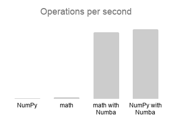
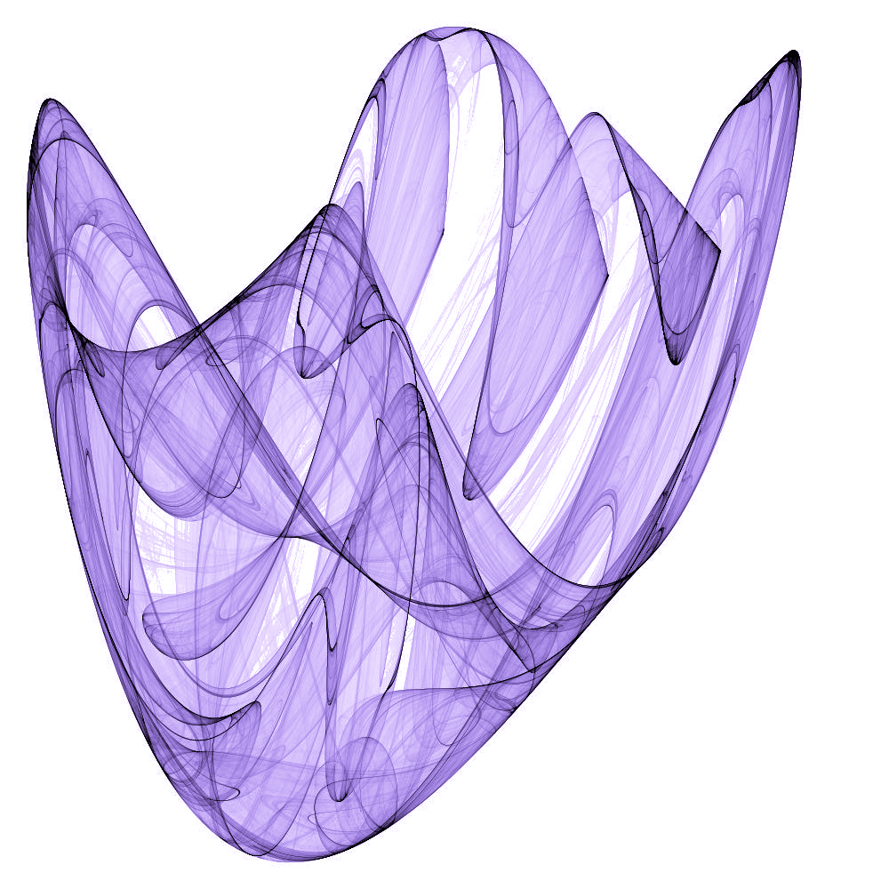
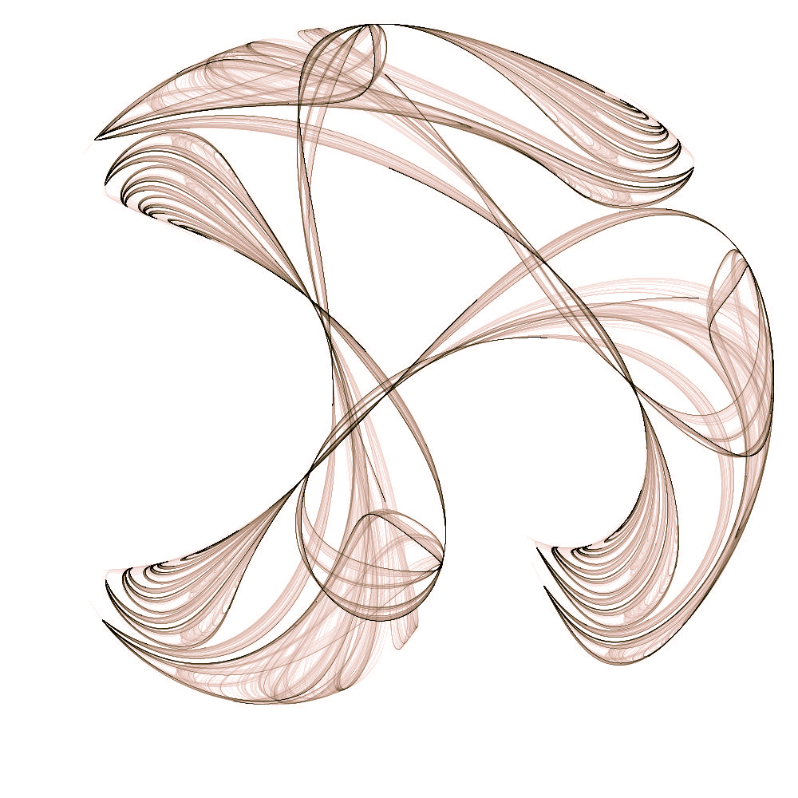
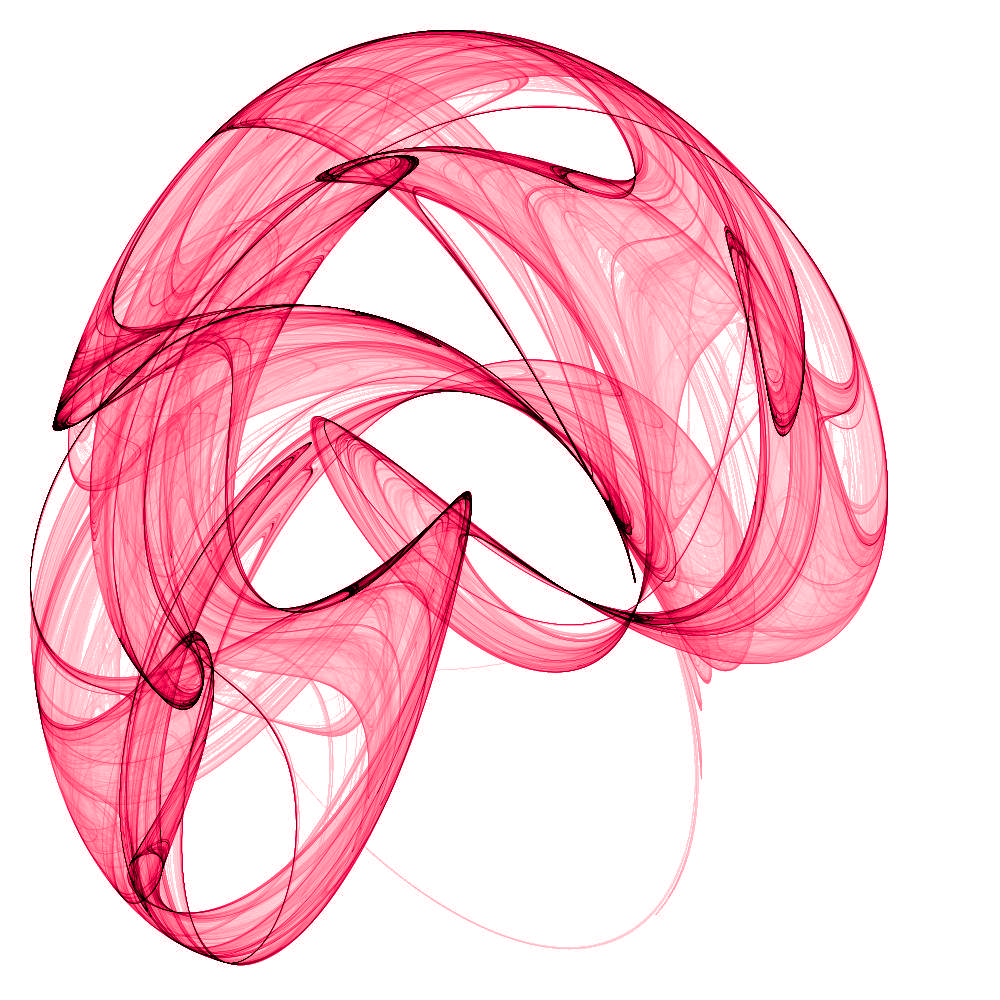
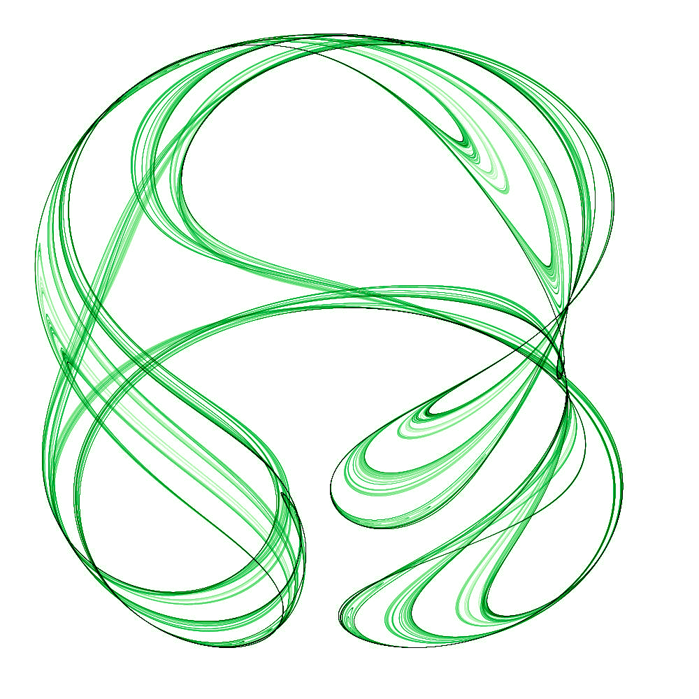
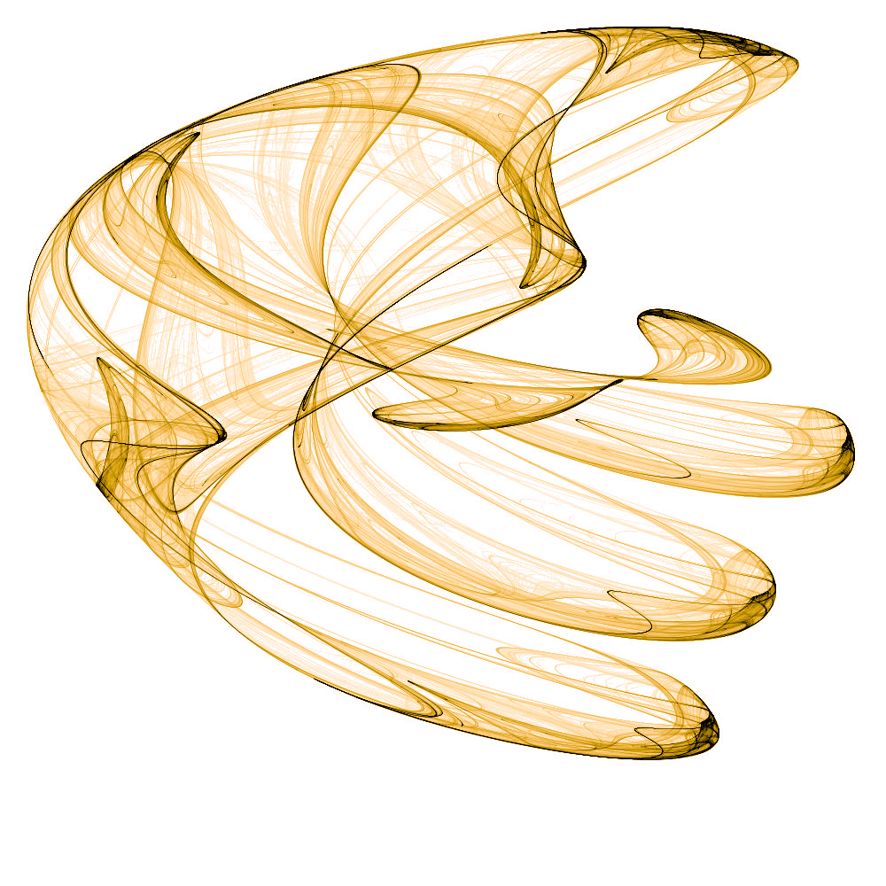

# Clifford Attactors & Numba

## Clifford Attactors  -  Beautiful Graphs

Clifford Attractors are sequences of 2-dimensional vectors ),
where each new vector N+1 is determined by the preceding vector N, as well as four parameters a, b, c and d, as below.

%20%2B%20c%20\cdot%20cos(a%20\cdot%20x_{1,n}))

%20%2B%20d%20\cdot%20cos(b%20\cdot%20x_{2,n}))

It can be generalized to higher dimensions, as below. For D dimensions in x, the parameters  are (D x D) matrices with suitable values.

)

High resolution density plots of such a sequence can be things of beauty, reminiscent of old school screen savers.

## Numba  -  Supercharging calculations

[Numba](https://numba.pydata.org/ "Numba") translates Python functions to optimized machine code, to drastically quicken calculations and reaching speeds similar to C or Fortran.
There are three simple steps when using Numba in python:
1. Import just-in-time compilation; `from numba import jit`
2. Add a decorator to the function, e.g. `@jit(nopython=True)`
3. Use only supported variable types and functions

### Numba speed benchmarks
Numba delivers a 4,300% speed improvement, compared to using `math` trigonometry functions.
This is a remarkable improvement; to achieve the same performance increase through hardware development would
take over a decade, if done according to Moore's law (doubling performance every 2 years).

The improvement compared to a pure NumPy implementation is even more impressive; 18,000%.

#### Execution times for sampling Clifford Attractors using different setups

|                    | With Numba | Without Numba |
| ------------------ |-----------:|--------------:|
| math trigonometry  |  0.224474  |     9.65321   |
| NumPy trigonometry |  0.213497  |    40.35556   |

See timit_clifford_attractors.py for details of the test.

## High Resolution Attractors

By sampling a large number (tens of billions) of points, we can generate high resolution density plots.
Naturally, we use Numba to iterate faster.

Below are example plots, selected after a grid search over the parameter space.

## Animated 2D Attractors

We can [animate a 2D attractor](https://www.youtube.com/watch?v=xWeY2pr6BDI "See animation in YouTube"), by gradually changing the parameters over time.

